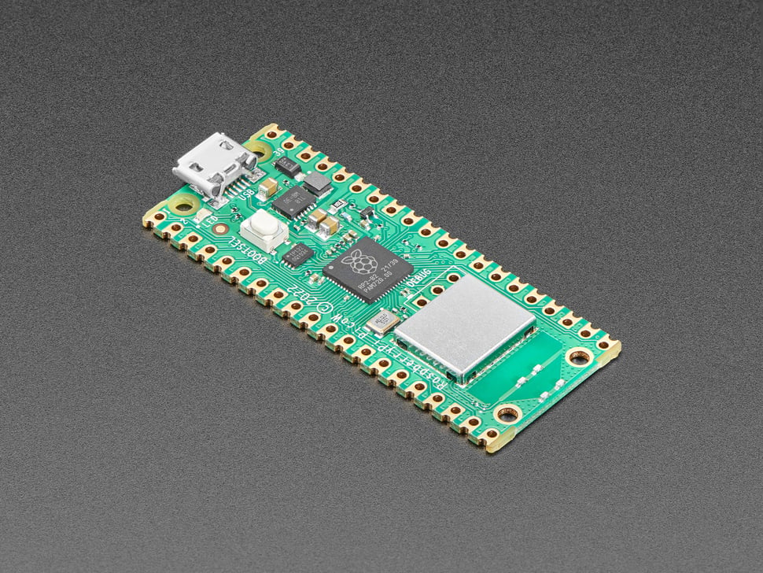

<h1 style="color:blue;" align="center">Raspberry Pi Pico W DUINO COIN MINER</h1>

code for rpi pico w (rp2040) duino coin miner

 
 

 

STEP  | Description
------------- | -------------
[1.]  | Install Arduino IDE
[2.]  | Download these packages by board manager URL's found in File/Preferences    https://arduino.esp8266.com/stable/package_esp8266com_index.json   https://github.com/earlephilhower/arduino-pico/releases/download/global/package_rp2040_index.json   https://raw.githubusercontent.com/Wiz-IO/wizio-arduino-pico/main/package_wizio.pico_index.json   https://raw.githubusercontent.com/espressif/arduino-esp32/gh-pages/package_esp32_index.json
[3.] | Change variables based on your Duino account *DUCO_USER,*MINER_KEY,*SSID,*PASSWORD,*RIG_IDENTIFIER
[4.] | Install these libraries     ArduinoJson   ArduinoOTA   WiFiClient   HTTPClient
[5.] | Upload and run it for board *Raspberry Pi Pico W*
 

